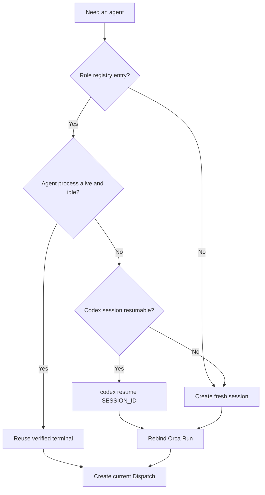

# Queue / Python Agent Pipeline

updated_at: 2026-08-30
status: Python-PM-only repository lifecycle authority active; unattended Queue scheduler not installed

This document records how Queue roles, Python execution state, optional Orca state, and Codex sessions
are resumed without creating a new session or Run for every piece of work. It
does not replace the canonical Queue protocol in `README.md`, the current model
snapshot in `WORKFLOW.md`, or live state in `BOARD.md`.

## Design objective

- MAIN records user intent and global routing without becoming an execution
  bottleneck.
- The Project Manager reuses one durable coordination context.
- Domain Leads reuse role-specific Codex sessions and supervise Workers and
  Reviewers.
- Workers are reused when identity, scope, and lifecycle ownership are safe.
- Reviewers remain independent from the implementation context for each
  immutable review generation.
- Queue remains business authority. The Python workflow-control package owns
  repository-local lifecycle execution and policy receipts; Orca is an
  optional supervised transport, not policy authority.
- One live MAIN/PM controller generation is the only Queue mutation and
  Dispatch-creation owner. Listeners and Watchdogs are read-only and wake that
  owner with idempotent material-event receipts.

```text
User -> conversation intake -> Project Goal
                                  |
                             Goal Planner
                                  |
                             Queue New
                                  |
                       single MAIN/PM triage
                                  |
                              Queue Ready
                                  |
                       durable Domain Lead claim
                          /          |          \
                       FAST       SINGLE      PARALLEL
                         \           |          /
                          Lead reconciliation
                                  |
                       immutable review generation
                                  |
                         fresh read-only Reviewer
                            /                 \
                     FIX -> Lead          PASS -> Done

Python Supervisor = SQLite machine truth + JSONL events + Markdown projection
Listener / Watchdog = observe -> one wake -> MAIN/PM; never Dispatch creation

Orca -------------------------------- optional adapter / observer only
```

Every managed node enters through the role bootstrap in `.agents/roles/README.md`:
`AGENTS.md -> common role contract -> one role document -> exact Task packet`.
The packet pins document digests and the Agent must acknowledge them before
using role authority. This keeps a durable session reusable without assuming
that an old conversation still carries the current rules.

## Single conductor and wake ownership

The durable PM role is the one conductor. Every Queue mutation, Lead creation,
Worker creation and Reviewer creation must be attributable to its current
controller generation. A Listener may prove a stale lease, completion,
question, escalation, or material file/Queue transition and send one wake to
that PM. It cannot answer by creating the missing agent itself.

Creation is idempotent. Lead and Worker attempts key on Queue Task, role and
attempt; Reviewer attempts additionally key on the immutable review generation.
The controller checks live, settled and fenced history before launch. The first
accepted attempt owns the work; a racing duplicate is recorded and fenced
without a second Queue mutation or filesystem writer.

Durable structured mail records the event, but an idle agent prompt may require
one separate wake input. The same wake receipt must not be delivered through
both PM and Listener paths. A transport outage or a visible spinner is never a
reason to create a replacement; liveness requires current Task/Dispatch
identity plus heartbeat, sanitized output progress, or an accepted lifecycle
event.

## Identity and lifetime

| Identity | Lifetime | Reuse rule |
|---|---|---|
| Codex session ID | Durable across process restarts | Resume the same PM or Domain Lead conversation when its role and worktree still match. |
| Orca Run ID | Durable coordination namespace | Rebind the same PM or Lead Run after restart. Create a new Run only when the objective or ownership boundary materially changes. |
| Orca Task ID | Durable work item | Keep it for the same Queue-derived work. Do not create a duplicate merely to recover a process. |
| Orca Dispatch ID | One execution attempt | Never reuse as a new attempt. Settle the old attempt, then create a fresh Dispatch linked by retry provenance when required. |
| Terminal handle | Runtime-scoped routing handle | Reuse only after the current Orca runtime proves it is live and belongs to the expected worktree. Re-list after an Orca restart. |
| Review generation | Immutable candidate snapshot | Use a fresh independent Reviewer context. Any candidate change requires a new submitted generation. |

The Codex session ID restores conversation context. It does not restore Orca
Dispatch authority. A resumed agent must be rebound to the correct Run and
receive a current Task/Dispatch lifecycle before supervised work continues.

## Python operational control plane

The project-local Python controller is the repository-local lifecycle authority. It
can run with Orca disabled and has five deliberately separate boundaries:

1. `RequestQueueStatusAdapter` reads the canonical manager's compact Queue
   snapshot. `WorkflowController.pump_queue_snapshot` combines that snapshot
   with sanitized workflow events under a monotonically fenced generation.
2. `WorkflowController` records accepted facts in the durable workflow state,
   ignores an exact duplicate without repeating its action, rejects an older
   lifecycle fact, and emits a content-addressed pump receipt. It atomically
   reserves the generation and event disposition before any runner side effect;
   a simultaneous newer generation therefore observes the reserved event and
   loses without launching a second action. Replaying the same generation and
   input returns the identical receipt.
3. `InjectedDirectRunner` performs launch, resume, and settlement only through
   an injected idempotent boundary. Every operation carries a stable
   generation-independent `operation_id`; its receipt states
   `transport=direct`, `orca_used=false`, and
   `production_mutated=false`. Orca may carry messages but is not required for
   the event pump or its disabled-Orca canary.
4. `WorkflowSupervisor` combines the pure `RoleWatchdog` with injected direct
   task and role-session runners. Bounded terminal previews are reduced in
   memory to `INPUT_REQUIRED` or `UNKNOWN`; raw prompts, commands, and
   transcripts are discarded. A connected terminal therefore cannot mask a
   stale heartbeat, a failed Dispatch, or an interactive PowerShell parameter
   prompt. PM sessions without a Queue Task use identifier-only
   interrupt/resume receipts, while Queue attempts preserve exact Task and
   retry provenance.
5. `DiscoveryRegistrar` accepts a Worker or Reviewer finding validated by the
   routed Lead, or a Lead-origin finding self-validated by that same routed
   Lead, only at the current Lead generation. All paths require bounded
   reproducible evidence, a disjoint suspected scope, and duplicate handling.
   The canonical sink invokes only `scripts/request_queue.py discover`,
   preserves `reported_by_role`, and returns `state=new` plus
   `executable=false`; MAIN triage is still required before any candidate can
   become Ready.

Routing continues to use the deterministic Queue work-item policy, including
dependency, writer-lane, resource-lock, and exact-scope conflicts. Queue state
changes remain serialized by `scripts/request_queue.py`; the controller never
edits Queue files directly and never infers Queue completion from a runner
receipt.

The controller holds its durable `BEGIN IMMEDIATE` generation/event lock until
all accepted direct action receipts settle. This intentionally serializes
in-flight lifecycle effects so a newer REVIEW settlement cannot overtake an
older unresolved ACTIVE launch even when the two events have different IDs.

Watchdog recovery is bounded to three attempts by default. Connected/running is
not sufficient health evidence: a fresh sanitized output timestamp can offset
a delayed heartbeat, but stale heartbeat and stale output together are a
recovery fact. A bounded PowerShell input prompt older than the prompt timeout
is interrupted and the same role session is resumed idempotently. An agent
reported live behind an unverified terminal is still left alone until terminal
identity is proved.

Recovery is Queue-state aware. An `active` attempt may settle and retry the same
Task, `review` retries only the independent review phase, and
`ready|waiting|blocked|done` settles stale execution residue without relaunching
implementation. Missing or unreadable Queue state is fail-closed as
`WAIT_FOR_QUEUE_RECONCILIATION`; it never guesses which phase to restart. A
transport outage is recorded as
`WAIT_FOR_DIRECT_HEALTH_PROBE`; it never proves that every agent died and never
causes a duplicate retry. Every mutating recovery requires exact Task or role
identity, generation, prior Dispatch where applicable, and deterministic
provenance. Replaying the same observation returns the same receipts without a
second side effect.

The supported production composition is the active repository-local lifecycle
authority at `data/runtime/python_pm`. Its CLI exposes `status`, read-only
`canary`, workspace-write `run`, and exact stale-generation `rollback`; it has
no Orca or fake production fallback. This cutover does not install a hook,
activate an unattended Queue polling scheduler, automatically promote policy,
or broaden financial/access/secret/destructive authority. Those remain separate
reviewed operations.

## Offline policy lifecycle

Policy changes are proposals, never direct production mutations. A proposal is
content-addressed and binds one accepted workflow-event snapshot generation,
its event IDs and canonical event digest, and the digest of its acceptance
receipt. Offline replay rejects a stale proposal generation or any substituted
event set before it produces a deterministic receipt.

Promotion eligibility requires all of the following receipts for the same
immutable proposal generation:

1. deterministic replay of the accepted snapshot;
2. `PASS` from a reviewer identity different from the implementation identity;
3. a bounded canary receipt whose criteria were explicitly enabled and met.

Canary evaluation is disabled by default. Promotion and rollback functions
produce content-addressed decision receipts with `production_mutated=false`;
they do not edit Queue state, activate a scheduler, cut over production, or
call an external service. A later separately reviewed operation must consume an
approved receipt to perform any authorized cutover.

Authority evaluation is fail closed. Local proposal and replay work is allowed;
account reads, canaries, promotion, rollback, and other standing-authority
actions require both standing authority and independent review. Broker/order,
transfer/withdrawal, financial mutation, access-control, secret handling,
paid-service, and destructive-migration actions remain prohibited even when a
caller claims review or standing authority. Unknown action classes are rejected.

## Durable role registry

Keep one local, identifier-only registry for resumable roles. It must never
contain secrets, credentials, account identifiers, full prompts, or terminal
transcripts.

```yaml
role_key: project_manager
codex_session_id: <uuid-or-session-name>
orca_run_id: <run_id>
worktree_id: <full-repo-id-and-path>
terminal_handle: <current-runtime-handle-or-null>
runtime_id: <orca-runtime-id-at-last-verification>
active_task_id: <task_id-or-null>
active_dispatch_id: <dispatch_id-or-null>
last_verified_at: <timestamp>
state: active | idle | stopped | recovery_required
```

The Orca fields above are compatibility locators for the optional Orca adapter,
not health evidence and not control-plane authority. The direct role-session
runner keys recovery by `role_key`, `codex_session_id`, registry generation and
provenance, so a taskless PM can be recovered without inventing a Queue Task.

Recommended stable role keys are `project_manager`, `lead_data`, `lead_gui`,
`lead_backtest`, and other domain-specific Leads. Worker records may be pooled
under their Lead. Reviewer records are receipts, not preferred resume targets.

## Normal allocation policy

1. Read the Queue worklist and the role registry before creating anything.
2. Reuse the durable PM Run and PM Codex session.
3. Route work to the existing Domain Lead session when its role and worktree
   match.
4. Reuse an idle Worker terminal only after the prior Dispatch settled and
   cleanup ownership transferred to the new Dispatch.
5. Release a settled Worker when no immediate same-agent follow-up exists.
6. Create a fresh Reviewer for every required immutable review generation.
7. Create a fresh PM or Lead session only when no valid saved session exists,
   the role changes, or context isolation is required.



## Restart and crash recovery

Recovery is reconciliation, not blanket recreation. Python PM state is checked
first; Orca is inspected only when an explicitly configured optional adapter
was used for the affected attempt.

1. Run the Python PM `status` command against the canonical repository root and
   classify the writer as `idle`, `live`, `stale`, or `uncertain`.
2. Compare the canonical SQLite/JSONL state, Queue snapshot, and sanitized
   activity rows with the durable role registry.
3. Classify each saved role:
   - `live`: expected agent process and terminal are both verified;
   - `shell_only`: terminal survived but Codex exited;
   - `terminal_missing`: Run/session history exists but the old handle is gone;
   - `stale_dispatch`: Orca reports active work but no matching agent process
     remains;
   - `settled`: completion exists and the resource is released or reusable.
4. Resume the exact Codex session only when its hashed identity, repository,
   task, profile, and generation still match. An Orca Run binding is optional
   compatibility metadata, not authority.
5. Settle each stale attempt before creating a replacement attempt. Never
   infer completion from a vanished Codex process or a surviving shell.
6. Resume the matching Lead session and attach a fresh attempt for unfinished
   work. Preserve the existing Queue Task and checkpoint.
7. Re-run required independent review from the exact current review generation.
8. Update the registry only after Python PM receipts prove the new identities;
   when an optional Orca adapter was involved, require its readback as additional
   evidence rather than a second source of truth.

Python lifecycle, wakeup, recovery, routing, discovery, and policy authority is
the active repository-local control plane. Orca may continue as an optional
transport without becoming a second source of policy truth. Unattended scheduler
activation remains a separate, explicitly reviewed operation.

Typical recovery commands are intentionally shown with placeholders:

```powershell
orca status --json
orca terminal list --json
orca orchestration run-list --json
orca orchestration task-list --run <run_id> --brief --json
orca orchestration worker-list --json
codex resume <codex_session_id>
orca orchestration run-use --id <run_id> --json
```

Exact supervisor-owned release, stop, retry, or terminal reuse follows the
current Orca receipt and Queue checkpoint. Destructive history reset and
untracked terminal injection require an explicit current instruction; never use
`orca orchestration reset --all` as routine recovery or history compaction.

## Stale Dispatch decision

| Observation | Handling |
|---|---|
| Agent alive, terminal active, current Dispatch verified | Continue waiting or read bounded progress. |
| Terminal survives at a shell prompt but Codex is absent | Treat as stale; settle the Dispatch before resuming the saved Codex session. |
| Terminal handle is missing after Orca restart | Re-list terminals; never send to both the old and replacement handles. |
| Worker reported `worker_done` | Reuse immediately for a known follow-up or release it before the next wait. |
| Release is unknown | Follow Orca's exact recovery receipt; do not substitute an untracked terminal close. |
| No resumable Codex session exists | Create one fresh agent, bind the existing Run/Task where valid, and record the replacement identity. |

## Accumulation and retention rules

- Historical Runs, Tasks, and Dispatches are audit records, not evidence that
  processes are consuming CPU or memory.
- Keep one long-lived PM session and normally one long-lived session per Domain
  Lead.
- Do not create a new PM Run for an ordinary restart, approval-rule reload, or
  process crash.
- Do not retain completed Worker terminals merely for later inspection;
  released output remains readable through Orca.
- Retain a Worker only for an explicit debugging reason and record that reason.
- A fresh Reviewer is an intentional exception to session minimization because
  independence matters more than session count.
- Periodic hygiene reports should distinguish live processes, live terminals,
  durable history, retained resources, release-unknown resources, and stale
  active Dispatches.
- History deletion is a separate destructive maintenance decision. It must not
  be mixed with normal startup reconciliation.

## Morning operational digest

The PM should provide a bounded summary after unattended work:

- Queue counts by state and dependency-ready Lead buffer;
- active PM and Lead role/session mappings;
- live versus stale Dispatches;
- Worker reuse, release, retention, and unknown-release counts;
- review generations waiting for an independent Reviewer;
- bottlenecks by Queue, PM, Lead, Worker, Reviewer, external gate, and writer
  lane;
- material workflow changes and the exact recovery performed;
- decisions that truly exceed delegated authority.
- Goal items with no Queue candidate, executable Goal items still stuck in New,
  Done Queue receipts not reflected in current Goal/Status, and stale Goal facts;
- duplicate wake, creation-race and fenced-attempt counts;
- repeated-acceptance canary/preflight results and the current accepted cycle
  count rather than merely the number of cycles executed.

The digest reports operations; it does not replace Queue receipts, Status,
contracts, or the append-only workflow changelog.
