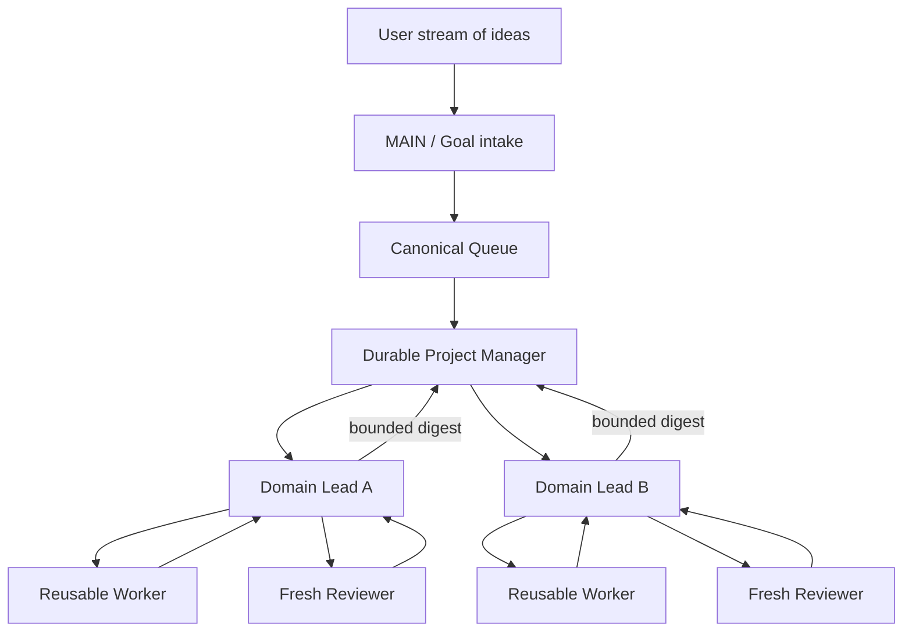
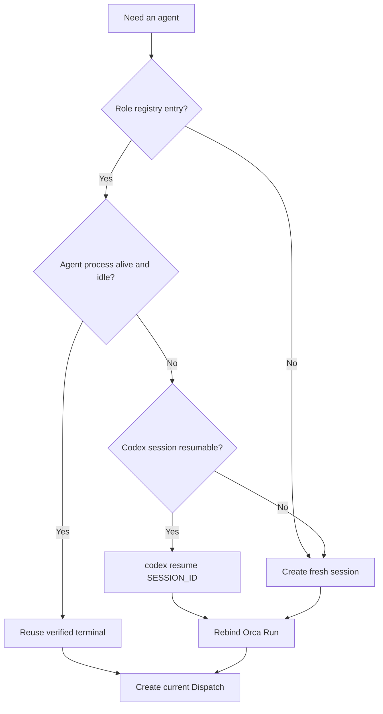

# Queue / Orca Agent Pipeline

updated_at: 2026-08-29
status: operational recovery, session reuse, and offline policy-evaluation guide

This document records how Queue roles, Orca execution state, and Codex sessions
are resumed without creating a new session or Run for every piece of work. It
does not replace the canonical Queue protocol in `README.md`, the current model
snapshot in `WORKFLOW.md`, or live state in `BOARD.md`.

## Design objective

- MAIN records user intent and global routing without becoming an execution
  bottleneck.
- The Project Manager reuses one durable coordination context.
- Domain Leads reuse role-specific Codex sessions and supervise Workers and
  Reviewers.
- Workers are reused when identity, scope, and lifecycle ownership are safe.
- Reviewers remain independent from the implementation context for each
  immutable review generation.
- Queue remains business authority. The Python workflow-control package owns
  deterministic offline policy evaluation and lifecycle receipts; Orca is an
  optional supervised transport, not policy authority.



## Identity and lifetime

| Identity | Lifetime | Reuse rule |
|---|---|---|
| Codex session ID | Durable across process restarts | Resume the same PM or Domain Lead conversation when its role and worktree still match. |
| Orca Run ID | Durable coordination namespace | Rebind the same PM or Lead Run after restart. Create a new Run only when the objective or ownership boundary materially changes. |
| Orca Task ID | Durable work item | Keep it for the same Queue-derived work. Do not create a duplicate merely to recover a process. |
| Orca Dispatch ID | One execution attempt | Never reuse as a new attempt. Settle the old attempt, then create a fresh Dispatch linked by retry provenance when required. |
| Terminal handle | Runtime-scoped routing handle | Reuse only after the current Orca runtime proves it is live and belongs to the expected worktree. Re-list after an Orca restart. |
| Review generation | Immutable candidate snapshot | Use a fresh independent Reviewer context. Any candidate change requires a new submitted generation. |

The Codex session ID restores conversation context. It does not restore Orca
Dispatch authority. A resumed agent must be rebound to the correct Run and
receive a current Task/Dispatch lifecycle before supervised work continues.

## Offline policy lifecycle

Policy changes are proposals, never direct production mutations. A proposal is
content-addressed and binds one accepted workflow-event snapshot generation,
its event IDs and canonical event digest, and the digest of its acceptance
receipt. Offline replay rejects a stale proposal generation or any substituted
event set before it produces a deterministic receipt.

Promotion eligibility requires all of the following receipts for the same
immutable proposal generation:

1. deterministic replay of the accepted snapshot;
2. `PASS` from a reviewer identity different from the implementation identity;
3. a bounded canary receipt whose criteria were explicitly enabled and met.

Canary evaluation is disabled by default. Promotion and rollback functions
produce content-addressed decision receipts with `production_mutated=false`;
they do not edit Queue state, activate a scheduler, cut over production, or
call an external service. A later separately reviewed operation must consume an
approved receipt to perform any authorized cutover.

Authority evaluation is fail closed. Local proposal and replay work is allowed;
account reads, canaries, promotion, rollback, and other standing-authority
actions require both standing authority and independent review. Broker/order,
transfer/withdrawal, financial mutation, access-control, secret handling,
paid-service, and destructive-migration actions remain prohibited even when a
caller claims review or standing authority. Unknown action classes are rejected.

## Durable role registry

Keep one local, identifier-only registry for resumable roles. It must never
contain secrets, credentials, account identifiers, full prompts, or terminal
transcripts.

```yaml
role_key: project_manager
codex_session_id: <uuid-or-session-name>
orca_run_id: <run_id>
worktree_id: <full-repo-id-and-path>
terminal_handle: <current-runtime-handle-or-null>
runtime_id: <orca-runtime-id-at-last-verification>
active_task_id: <task_id-or-null>
active_dispatch_id: <dispatch_id-or-null>
last_verified_at: <timestamp>
state: active | idle | stopped | recovery_required
```

Recommended stable role keys are `project_manager`, `lead_data`, `lead_gui`,
`lead_backtest`, and other domain-specific Leads. Worker records may be pooled
under their Lead. Reviewer records are receipts, not preferred resume targets.

## Normal allocation policy

1. Read the Queue worklist and the role registry before creating anything.
2. Reuse the durable PM Run and PM Codex session.
3. Route work to the existing Domain Lead session when its role and worktree
   match.
4. Reuse an idle Worker terminal only after the prior Dispatch settled and
   cleanup ownership transferred to the new Dispatch.
5. Release a settled Worker when no immediate same-agent follow-up exists.
6. Create a fresh Reviewer for every required immutable review generation.
7. Create a fresh PM or Lead session only when no valid saved session exists,
   the role changes, or context isolation is required.



## Restart and crash recovery

Recovery is reconciliation, not blanket recreation.

1. Confirm the Orca runtime is ready and record its current runtime ID.
2. List live terminals, Runs, Tasks, and Worker resources.
3. Compare those facts with the durable role registry.
4. Classify each saved role:
   - `live`: expected agent process and terminal are both verified;
   - `shell_only`: terminal survived but Codex exited;
   - `terminal_missing`: Run/session history exists but the old handle is gone;
   - `stale_dispatch`: Orca reports active work but no matching agent process
     remains;
   - `settled`: completion exists and the resource is released or reusable.
5. Resume the PM Codex session in the verified PM worktree and explicitly bind
   the durable PM Run.
6. Settle each stale Dispatch before creating a replacement attempt. Never
   infer completion from a vanished Codex process or a surviving shell.
7. Resume the matching Lead session and attach a fresh Dispatch for unfinished
   work. Preserve the existing Queue Task and checkpoint.
8. Re-run required independent review from the exact current review generation.
9. Update the registry only after Orca readback proves the new identities.

Python lifecycle, wakeup, recovery, routing, discovery, and policy authority is
the target control plane. Until a separately accepted cutover activates those
operations, this policy lifecycle remains offline and Orca may continue as an
optional transport without becoming a second source of policy truth.

Typical recovery commands are intentionally shown with placeholders:

```powershell
orca status --json
orca terminal list --json
orca orchestration run-list --json
orca orchestration task-list --run <run_id> --brief --json
orca orchestration worker-list --json
codex resume <codex_session_id>
orca orchestration run-use --id <run_id> --json
```

Exact supervisor-owned release, stop, retry, or terminal reuse follows the
current Orca receipt and Queue checkpoint. Destructive history reset and
untracked terminal injection require an explicit current instruction; never use
`orca orchestration reset --all` as routine recovery or history compaction.

## Stale Dispatch decision

| Observation | Handling |
|---|---|
| Agent alive, terminal active, current Dispatch verified | Continue waiting or read bounded progress. |
| Terminal survives at a shell prompt but Codex is absent | Treat as stale; settle the Dispatch before resuming the saved Codex session. |
| Terminal handle is missing after Orca restart | Re-list terminals; never send to both the old and replacement handles. |
| Worker reported `worker_done` | Reuse immediately for a known follow-up or release it before the next wait. |
| Release is unknown | Follow Orca's exact recovery receipt; do not substitute an untracked terminal close. |
| No resumable Codex session exists | Create one fresh agent, bind the existing Run/Task where valid, and record the replacement identity. |

## Accumulation and retention rules

- Historical Runs, Tasks, and Dispatches are audit records, not evidence that
  processes are consuming CPU or memory.
- Keep one long-lived PM session and normally one long-lived session per Domain
  Lead.
- Do not create a new PM Run for an ordinary restart, approval-rule reload, or
  process crash.
- Do not retain completed Worker terminals merely for later inspection;
  released output remains readable through Orca.
- Retain a Worker only for an explicit debugging reason and record that reason.
- A fresh Reviewer is an intentional exception to session minimization because
  independence matters more than session count.
- Periodic hygiene reports should distinguish live processes, live terminals,
  durable history, retained resources, release-unknown resources, and stale
  active Dispatches.
- History deletion is a separate destructive maintenance decision. It must not
  be mixed with normal startup reconciliation.

## Morning operational digest

The PM should provide a bounded summary after unattended work:

- Queue counts by state and dependency-ready Lead buffer;
- active PM and Lead role/session mappings;
- live versus stale Dispatches;
- Worker reuse, release, retention, and unknown-release counts;
- review generations waiting for an independent Reviewer;
- bottlenecks by Queue, PM, Lead, Worker, Reviewer, external gate, and writer
  lane;
- material workflow changes and the exact recovery performed;
- decisions that truly exceed delegated authority.

The digest reports operations; it does not replace Queue receipts, Status,
contracts, or the append-only workflow changelog.
