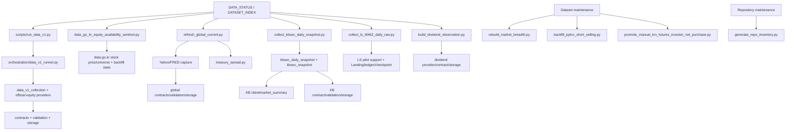

# Repository usage audit

Status: **READ-ONLY STATIC AUDIT — NO DELETION AUTHORITY**  
Audit date: 2026-08-15 KST

The complete file-level result is
[REPOSITORY_USAGE_AUDIT.csv](REPOSITORY_USAGE_AUDIT.csv). It covers every file
returned by `rg --files src scripts tests` at audit time: **326 files**.

## Method and classifications

Evidence was ranked as current STATUS/runbook routing, README entrypoints, Dataset
Index collector links, Python imports, pytest references, and then Git history for
uncertain files. Dynamic imports and human-only invocations cannot be proven absent
by this static audit, so files without positive evidence remain `UNUSED_UNKNOWN`.

| Classification | Files | Meaning |
|---|---:|---|
| `ACTIVE_RUNTIME` | 96 | Current reusable package/runtime, contract, storage, validation, or builder code |
| `ACTIVE_OPERATION` | 11 | Current status/index/runbook or supported maintenance entrypoint |
| `TEST_SUPPORT` | 117 | Pytest test/fixture, or source used only by retained tests |
| `ONE_OFF_COMPLETED` | 92 | Completed pilot, diagnostic, migration, audit, backfill, or historical builder |
| `SUPERSEDED` | 6 | Replaced by a named current path or current canonical implementation |
| `UNUSED_UNKNOWN` | 4 | No current runtime caller or routing evidence; removal requires review |

Classification is about current use, not code quality or whether historical tests
should still pass. A completed script can remain valuable reproducibility evidence.

## Active entrypoint graph



These ten Python roots plus the KB scheduler-registration PowerShell script account
for the 11 `ACTIVE_OPERATION` files. Only `scripts/run_data_v1.py` is the general
supported CLI; the others remain explicitly guarded operations.

## Duplicate and overlapping implementations

| Area | Overlap | Current owner / recommendation |
|---|---|---|
| KB authentication | `pilot_kbsec_token.py`, token support, and `smoke_kbsec_ivsa0070.py` overlap the corrected daily pipeline | Daily snapshot client/pipeline owns current auth; retain old files as superseded evidence |
| Short Investor | old pykrx pilot, range diagnostics, A007 diagnostic family, and current backfill | Current short-selling backfill owns maintenance; completed diagnostics remain evidence only |
| Market investor | generic `providers/pykrx/kr_investor_flow.py` overlaps the completed legacy+Toss bridge | Published investor bridge is canonical; generic provider is superseded/test-only |
| Treasury spread | standalone `build_treasury_spread.py` overlaps transactional `refresh_global_current.py` | Global refresh owns current yield+spread promotion; standalone script is superseded |
| KOSPI200 PCR | legacy PCR builder and 2020-present/modern builder | Retain both only while the provider-segment bridge requires both eras; expose one maintenance facade later |
| LS t8462 | OAuth pilot, follow-up, Raw backfill, semantic audits, and daily collector | Daily Raw collector is current; pilot/backfill/audits are completed evidence and reusable parsing should eventually live under `src/` |
| BOK ECOS | metadata pilot, page-semantics pilot, support modules, and history backfill | History artifact is complete; retain as one completed acquisition family, not active entrypoints |
| Toss | smoke, probe, refinement, historical backfill, and Treasury rebuild | Completed histories own artifacts; no active general Toss operation is currently routed |
| data.go.kr corporate actions | pilot/current-scope/snapshot/build scripts for issuance, rights, and dividend | Keep source-observation builders separate by grain; consolidate shared capture/checkpoint primitives only |
| Legacy migrations | legacy derivatives and investor import scripts plus retained promotion | Historical reconstruction only; keep outside the eventual active operations surface |

## Unreferenced scripts

The following have no literal current documentation path/name reference and no
matching focused-test reference. Some still import production modules, so this is a
review list, not a deletion list:

- `scripts/manual/analyze_marcap_candidate.py` — `UNUSED_UNKNOWN`; last Git evidence
  is the 2026-08-11 Data v1.1 historical-equity commit.
- `scripts/manual/audit_dataset_inventory.py`
- `scripts/manual/audit_kbsec_daily_snapshot.py`
- `scripts/manual/backfill_tossinvest_historical.py`
- `scripts/manual/build_kospi200_option_pcr_2020_present.py`
- `scripts/manual/import_legacy_market_investor.py`
- `scripts/manual/migrate_contract_parquet_schema.py`
- `scripts/manual/migrate_legacy_kospi200_derivatives.py`
- `scripts/manual/rebuild_toss_treasury_from_landing.py`
- `scripts/manual/retain_manual_krx_derivatives_investor.py`
- `scripts/manual/smoke_kbsec_ivsa0070.py`
- `scripts/manual/smoke_tossinvest_market.py`
- `scripts/manual/smoke_tossinvest_token.py`

All except `analyze_marcap_candidate.py` are classified from retained historical or
superseded workflow evidence. Before moving any of them, check dynamic file loading
and retained command transcripts.

## Source modules with no current runtime caller

| Module | Classification | Evidence / uncertainty |
|---|---|---|
| `src/stock_data/contracts/availability.py` | `TEST_SUPPORT` | Imported only by availability regression tests |
| `src/stock_data/pipelines/krx_derivatives_investor.py` | `UNUSED_UNKNOWN` | Permission-blocked implementation; one test caller, no active operation |
| `src/stock_data/pipelines/marcap_historical_backfill.py` | `UNUSED_UNKNOWN` | No importer or test; last changed in the 2026-08-11 Data v1.1 commit |
| `src/stock_data/providers/data_go_kr/master.py` | `UNUSED_UNKNOWN` | No importer, test, current status, or runbook route |
| `src/stock_data/providers/pykrx/kr_investor_flow.py` | `SUPERSEDED` | Only tests call it; current status routes the provider-segment bridge |
| `src/stock_data/contracts/fred_alfred_observation.py` and `validation/fred_alfred_observation.py` | `ONE_OFF_COMPLETED` | Retained ALFRED pilot/test chain; not registered or called by a current operation |

Package `__init__.py` files are excluded from this no-caller list because package
loading and public re-exports are runtime roles even when static inbound counts are
zero.

## Tests covering obsolete or completed code

These are historical regression tests, not automatically obsolete tests:

- `test_kbsec_token_pilot.py` covers the superseded flat-envelope token support.
- `test_pilot_pykrx_short_selling.py` covers the superseded short-selling pilot.
- `test_kr_market_data.py` and `test_pykrx_automation_guard.py` cover the superseded
  generic pykrx investor provider.
- `test_a007_*` and `test_verify_a007_*` cover completed access/boundary diagnostics.
- BOK pilot/page/backfill, OpenDART pilot/lineage, FRED/ALFRED pilot, legacy
  migration, retained-promotion, and completed source-audit tests protect retained
  evidence rather than current routine entrypoints.

Keep this suite until completed code is deliberately archived or extracted. If the
code moves out of the active package, move these tests to an explicit
`tests/historical/` boundary rather than silently deleting them.

## Smallest reasonable target structure

No move is authorized by this audit. A later bounded cleanup should target:

```text
scripts/
  run_data_v1.py
  operations/
    data_go_kr_equity_availability_sentinel.py
    refresh_global_current.py
    collect_kbsec_daily_snapshot.py
    collect_ls_t8462_daily_raw.py
    build_dividend_observation.py
    rebuild_market_breadth.py
    backfill_pykrx_short_selling.py
    promote_manual_krx_futures_investor_net_purchase.py
  maintenance/
    generate_repo_inventory.py
  historical/                 # completed/superseded commands, non-default context

src/stock_data/
  contracts/ providers/ pipelines/ storage/ validation/
  derived/ published/ audit/ orchestration/

tests/
  unit/                        # active package behavior
  operations/                  # active guarded entrypoints
  historical/                  # retained completed/superseded workflow regression
  fixtures/
```

Before implementing that target, resolve the four `UNUSED_UNKNOWN` files, verify
all dynamic imports, decide whether the permission-blocked KRX implementation stays
in `src/`, and create one import facade for each remaining multi-script acquisition
family. Do not collapse distinct source grains or move historical evidence into
active runtime modules merely to reduce file count.
