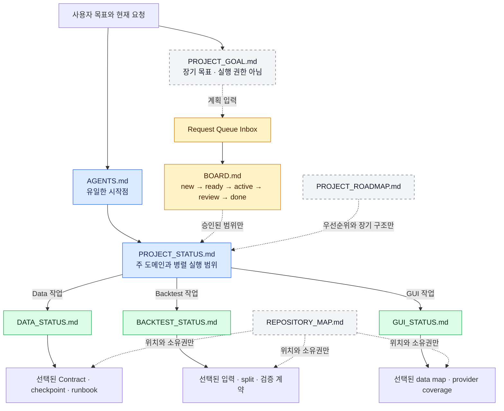
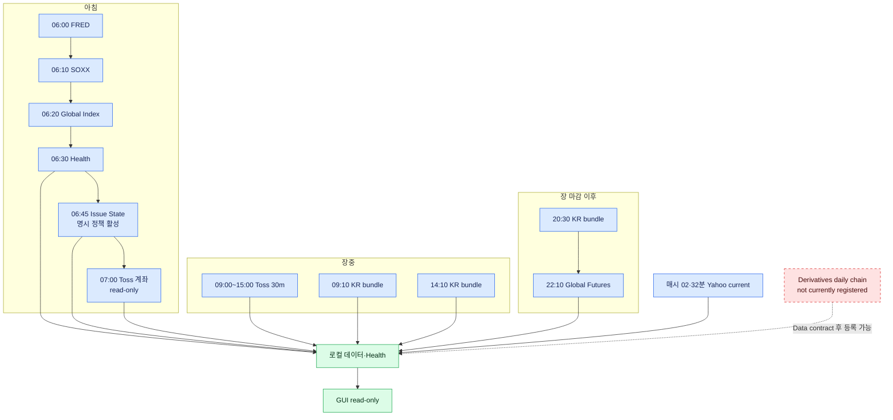

# Project Operations Map

Status: **SUPERSEDED 2026-08-27**. Use
`docs/project/SCHEDULER_STATUS.md` for installed task structure,
`docs/data/DATA_STATUS.md` for operation truth, and
`docs/gui/GUI_REFRESH_STATUS_CONTRACT.md` for GUI freshness projection. This
file is retained only as historical context.

```drawio width=800
<mxfile>
  <diagram id="default" name="Page-1">
    <mxGraphModel>
      <root>
        <mxCell id="0"/>
        <mxCell id="1" parent="0"/>
      </root>
    </mxGraphModel>
  </diagram>
</mxfile>
```


분류: `REFERENCE / VISUAL NAVIGATION`

이 문서는 프로젝트 구성, 스케줄러, 데이터 흐름, GUI, Backtest, ML 및
요청 큐의 관계를 한곳에서 보는 시각 지도다. 현재 상태나 실행 권한을
결정하지 않는다. 실제 작업 전에는 반드시
`AGENTS.md -> PROJECT_STATUS -> 선택된 Domain STATUS` 순서로 확인한다.

## 1. 프로젝트 제어 구조



핵심은 Goal, Roadmap, Inbox가 작업 후보와 구조를 설명하고, 실제 실행 범위는
현재 Project/Domain Status의 standing authorization과 계약이 결정한다는 점이다.

## 2. 스케줄러에서 GUI까지

```mermaid
flowchart LR
    TS["Windows Task Scheduler"] --> ENTRY["지원 scheduler entrypoint"]
    ENTRY --> GATE["달력 · 시간 · occurrence · lock gate"]
    GATE --> PROVIDER["허가된 provider lane"]
    PROVIDER --> LANDING["Landing<br/>손실 없는 원문 보존"]
    LANDING --> VALIDATE["계약 검증"]
    VALIDATE --> NORMAL["Normalized"]
    NORMAL --> DERIVED["Derived"]
    DERIVED --> PUBLISHED["Published"]
    NORMAL --> CURRENT["GUI current projection"]
    DERIVED --> CURRENT
    PUBLISHED --> HEALTH["Daily Health"]
    CURRENT --> HEALTH
    HEALTH --> DASH["Local Dashboard"]
    CURRENT --> DASH
    PUBLISHED --> DASH

    ENTRY --> RECEIPT["scheduler last-result JSON<br/>STARTED + terminal runtime events"]
    VALIDATE -->|실패·부분·stale| PRESERVE["기존 유효 데이터 보존<br/>fail closed"]
    PRESERVE --> RECEIPT
    RECEIPT --> DIAG["상태·오류 점검"]
    DIAG --> ISSUE["sanitized issue-state/v1<br/>로컬 원자 저장"]
    ISSUE -.->|명시 정책 임계치 충족 시 discover만| INBOX["Request Queue inbox/new"]

    DASH -.->|"provider 호출 없음<br/>데이터 갱신 없음"| LOCAL["로컬 read-only 소비자"]

    classDef runtime fill:#dbeafe,stroke:#2563eb,color:#172554;
    classDef data fill:#dcfce7,stroke:#16a34a,color:#052e16;
    classDef evidence fill:#fef3c7,stroke:#d97706,color:#451a03;
    classDef safe fill:#fee2e2,stroke:#dc2626,color:#450a0a;
    class TS,ENTRY,GATE,PROVIDER runtime;
    class LANDING,VALIDATE,NORMAL,DERIVED,PUBLISHED,CURRENT,HEALTH,DASH data;
    class RECEIPT,DIAG,ISSUE,INBOX evidence;
    class PRESERVE safe;
```



`LastTaskResult=0`은 프로세스가 정상 종료됐다는 뜻일 뿐, 데이터가 최신
거래일로 전진했다는 보장은 아니다. 실제 결과는 `artifacts/scheduler_logs/`,
`artifacts/daily_health/`, 해당 checkpoint/state와 Data Status를 함께 본다.

## 3. 현재 스케줄러 지도

아래는 현재 등록 대상으로 관리되는 작업 정의다. `상태`는 이 표에 고정하지
않고 다음 절의 실시간 조회로 확인한다. 시간은 KST다.

| Windows 작업 | 주기 | 담당 흐름 | 실행 진입점 |
|---|---:|---|---|
| `STOCK_DATA_FRED_DAILY` | 매일 06:00 | FRED 거시·금리 daily | `run_provider_scheduler.py --lane FRED_DAILY` |
| `STOCK_DATA_GLOBAL_ETF_SOXX_DAILY` | 매일 06:10 | SOXX daily | `run_provider_scheduler.py --lane GLOBAL_ETF_DAILY` |
| `STOCK_DATA_GLOBAL_INDEX_DAILY` | 매일 06:20 | S&P 500·Nasdaq 계열 daily | `run_provider_scheduler.py --lane GLOBAL_INDEX_DAILY` |
| `STOCK_DATA_DAILY_HEALTH` | 매일 06:30 | 로컬 dataset Health 재검증 | `reconcile_daily_health_artifact.py` |
| `STOCK_PROJECT_ISSUE_STATE_SYNC` | 매일 06:45, 활성 | sanitized local issue 집계; 09:10 KR market scheduler의 반복 실패 2회만 명시 정책으로 Inbox 발견 | `sync_issue_state.py --enable-discovery` |
| `STOCK_DATA_TOSS_ACCOUNT_DAILY` | 매일 07:00 | 명시 selector 기반 Toss 계좌 read-only 스냅샷; 통화별 값 유지, 주문·계좌탐색 없음 | `run_toss_account_snapshot.py` |
| `STOCK_DATA_TOSS_DOMESTIC_30M` | 평일 09:00~15:00, 30분 | 005930·000660, KOSPI·KOSDAQ current | `collect_toss_domestic_ur246.py` 앞단 calendar gate |
| `STOCK_DATA_KR_MARKET_DAILY_0910` | 매일 09:10 | 지수 fundamentals, 공매도 거래, 유동성·신용 관찰 | `run_provider_scheduler.py --bundle KR_MARKET_DAILY --scheduled-slot 09:10` |
| `STOCK_DATA_KR_MARKET_DAILY_1410` | 매일 14:10 | canonical equity, 공매도 거래, 대차 | 같은 bundle의 14:10 occurrence |
| `STOCK_DATA_KR_MARKET_DAILY_2030` | 매일 20:30 | canonical equity, 공매도·대차, VKOSPI, 한국 지수, 투자자, 유동성·신용 | 같은 bundle의 20:30 occurrence |
| `STOCK_DATA_GLOBAL_FUTURES_DAILY` | 매일 22:10 | NQ·Gold·WTI daily | `run_provider_scheduler.py --lane GLOBAL_COMMODITY_DAILY` |
| `STOCK_DATA_YAHOO_MARKET_30M` | 매시 02·32분 | 13개 global current route와 VIX·미 국채 quote | `run_yahoo_market_current.py` |



09:10·14:10 작업은 놓친 occurrence를 임의 재생하지 않는다. 20:30 작업만
`StartWhenAvailable`과 bounded occurrence claim을 사용한다. 각 lane의 실제
provider 가능 여부는 Data Status와 해당 active runbook이 최종 결정한다.
`STOCK_PROJECT_ISSUE_STATE_SYNC`는 `StartWhenAvailable=false`, `IgnoreNew`,
`PT5M`, 단일 06:45 trigger와 활성 상태를 등록 직후 다시 읽어 모두 일치할
때만 설치 성공으로 본다. Discovery-disabled baseline 이후의 첫 명시 정책은
`kr_market_daily:0910` scheduler failure가 한 active epoch에서 두 번 반복될
때만 Inbox/new를 하나 만들며 다른 대상에는 암묵 기준을 적용하지 않는다.
`STOCK_DATA_TOSS_ACCOUNT_DAILY`는 `StartWhenAvailable=true`, `IgnoreNew`,
`PT5M`, 단일 07:00 trigger를 사용한다. KST 날짜 occurrence를 provider 접근
전에 먼저 claim하며 같은 날짜 재실행은 API 0이다. 결과 판단은
[`TOSS_ACCOUNT_SNAPSHOT_READONLY.md`](../data/operations/TOSS_ACCOUNT_SNAPSHOT_READONLY.md)의
식별자 없는 terminal receipt와 기존 스냅샷 보존 규칙을 따른다.

## 4. Backtest와 밤샘 ML의 격리

```mermaid
flowchart LR
    LOCAL["검증된 로컬 retained data"] --> FREEZE["해시로 고정된 Backtest input"]
    FREEZE --> SPLIT["시간순 분리"]
    SPLIT --> DEV["Development slice"]
    SPLIT --> HOLDOUT["Sealed holdout<br/>1,222 observations"]
    DEV --> FEATURES["6개 PIT-safe T+1 features"]
    DEV --> LABELS["20일 forward drawdown label"]
    FEATURES --> WF["Purged expanding walk-forward"]
    LABELS --> WF
    WF --> MODELS["Logistic · HGB · Random Forest"]
    MODELS --> OPTUNA["Optuna SQLite<br/>중단 후 resume 가능"]
    OPTUNA --> SUMMARY["state.json · summary.json"]

    HOLDOUT -.->|현재 접근·평가 금지| SEALED["holdout_results_reviewed=false"]
    SUMMARY -.->|typed GUI·local simulation 연결 가능| NOEXEC["비실거래 개발 결과"]

    classDef input fill:#dcfce7,stroke:#16a34a,color:#052e16;
    classDef research fill:#dbeafe,stroke:#2563eb,color:#172554;
    classDef sealed fill:#fee2e2,stroke:#dc2626,color:#450a0a,stroke-dasharray:5 5;
    class LOCAL,FREEZE input;
    class DEV,FEATURES,LABELS,WF,MODELS,OPTUNA,SUMMARY research;
    class HOLDOUT,SEALED,NOEXEC sealed;
```



밤샘 ML은 provider, scheduler, GUI, 계좌 및 주문 경로와 분리된 오프라인
개발 실험이다. 상세 계약은
[`OVERNIGHT_ML_RUNBOOK.md`](../backtest/OVERNIGHT_ML_RUNBOOK.md)가 소유한다.

## 5. 한 번에 상태 확인하기

### Windows 작업 상태

아래 명령은 등록 정의를 바꾸지 않고 `State`, 마지막 실행, 결과 코드와 다음
실행을 읽는다. 목록에 없는 작업은 출력되지 않는다.

```powershell
$taskNames = @(
    "STOCK_DATA_FRED_DAILY",
    "STOCK_DATA_GLOBAL_ETF_SOXX_DAILY",
    "STOCK_DATA_GLOBAL_INDEX_DAILY",
    "STOCK_DATA_DAILY_HEALTH",
    "STOCK_PROJECT_ISSUE_STATE_SYNC",
    "STOCK_DATA_TOSS_DOMESTIC_30M",
    "STOCK_DATA_KR_MARKET_DAILY_0910",
    "STOCK_DATA_KR_MARKET_DAILY_1410",
    "STOCK_DATA_KR_MARKET_DAILY_2030",
    "STOCK_DATA_GLOBAL_FUTURES_DAILY",
    "STOCK_DATA_YAHOO_MARKET_30M"
)
$taskNames | ForEach-Object {
    $task = Get-ScheduledTask -TaskName $_ -ErrorAction SilentlyContinue
    if ($null -ne $task) {
        $info = Get-ScheduledTaskInfo -TaskName $_
        [pscustomobject]@{
            TaskName       = $task.TaskName
            State          = $task.State
            LastRunTime    = $info.LastRunTime
            LastTaskResult = $info.LastTaskResult
            NextRunTime    = $info.NextRunTime
        }
    }
} | Format-Table -AutoSize
```

### 프로젝트 전체의 읽기 전용 점검

```powershell
# GUI·schema·freshness·scheduler를 provider 호출 없이 점검
.\.venv\Scripts\python.exe .\scripts\maintenance\run_release_readiness_smoke.py --output artifacts\release_readiness\release_readiness_latest.json

# 최근 scheduler 결과 파일의 수정 시각
Get-ChildItem .\artifacts\scheduler_logs\*_last.json |
    Sort-Object LastWriteTime -Descending |
    Select-Object LastWriteTime, Name

# GUI/Backtest의 최근 sanitized 실패
.\.venv\Scripts\python.exe .\scripts\maintenance\inspect_runtime_failures.py --limit 20

# 네 가지 allowlisted 로컬 증거를 issue-state/v1로 집계; 정책 파일이 없으면 Inbox 생성 0
.\.venv\Scripts\python.exe .\scripts\maintenance\sync_issue_state.py --project-root .

# agent 요청 큐
.\.venv\Scripts\python.exe .\scripts\request_queue.py status --compact

# 밤샘 ML
.\.venv\Scripts\python.exe .\scripts\run_overnight_ml.py --status
```

Release smoke는 `PASS=0`, `DEGRADED=2`, `FAIL=1`이다. provider 호출이나
스케줄러 변경은 하지 않지만 선택한 `artifacts/release_readiness/` 아래에
JSON 보고서를 갱신한다.

## 6. 어디를 보면 되는가

| 알고 싶은 것 | 현재 진실의 소유자 |
|---|---|
| 지금 프로젝트가 무엇을 하는가 | [`PROJECT_STATUS.md`](PROJECT_STATUS.md) |
| 특정 데이터가 최신이며 실행 가능한가 | [`DATA_STATUS.md`](../data/DATA_STATUS.md) + 선택된 runbook/checkpoint |
| GUI가 무엇을 실제 표시하는가 | [`GUI_STATUS.md`](../gui/GUI_STATUS.md) |
| Backtest·ML 입력과 holdout 상태 | [`BACKTEST_STATUS.md`](../backtest/BACKTEST_STATUS.md) + ML runbook/state |
| 작업이 Windows에서 실행 중인가 | `Get-ScheduledTask` / `Get-ScheduledTaskInfo` |
| 실행은 끝났지만 데이터가 전진했는가 | `artifacts/scheduler_logs/`, `artifacts/daily_health/`, dataset state |
| GUI·Backtest에서 무엇이 실패했는가 | `artifacts/runtime_logs/application/`과 inspector |
| 반복 실패·복구·임계치 판단을 함께 보려면 | `artifacts/issue_state/v1/issues.json`과 [`ISSUE_STATE_CONTRACT.md`](ISSUE_STATE_CONTRACT.md) |
| agent가 무엇을 처리 중인가 | [`BOARD.md`](../../artifacts/request_queue/BOARD.md) |

이 문서를 최신 상태의 대체물로 사용하지 않는다. 구성이나 작업 이름이
바뀌면 이 지도도 함께 갱신하되, 일시적인 `Ready/Running/Failed` 값은 여기
기록하지 않는다.
